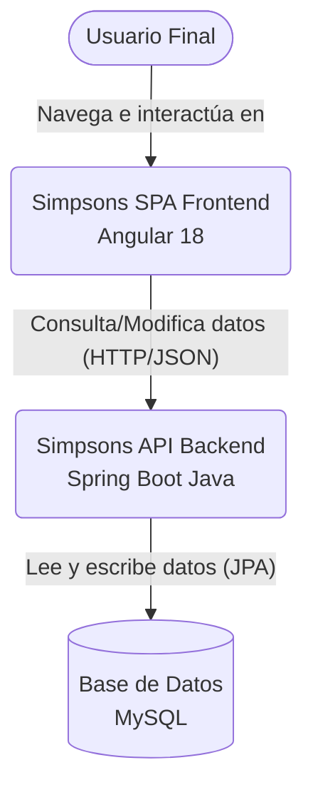
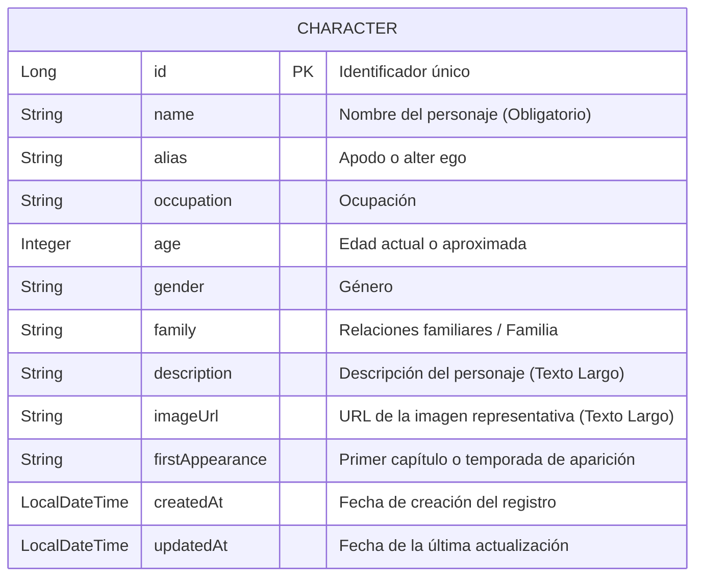
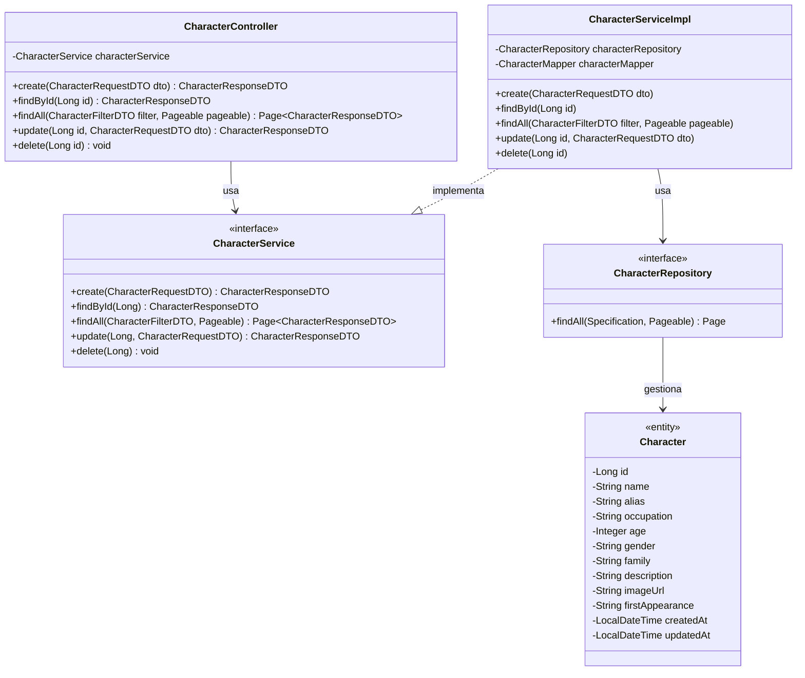

# Documentación de la Aplicación: The Simpsons App

Este documento presenta una descripción completa de la arquitectura, servicios y funcionalidad de la aplicación "The Simpsons App", tanto para su Frontend como Backend.

## 1. Explicación para el uso de la Aplicación

La aplicación es un sistema de gestión (**CRUD**) de personajes de Los Simpsons. Está dividida en dos componentes principales interactuando entre sí:

### Frontend (Angular 18)
- **Tecnologías:** Angular 18, PrimeNG (para componentes UI), SCSS.
- **Arquitectura:** Modular, dividida en `core` (modelos, servicios comunes), `shared` (componentes reutilizables) y `features` (lógica específica de cada vista de la aplicación).
- **Servicios:** Centralizados a través del `CharacterService` usando `HttpClient` para comunicarse con la API.
- **Flujo de uso:**
  1. El usuario visualiza la lista o grilla de personajes.
  2. A través de la interfaz puede aplicar filtros de búsqueda (por nombre, etc.).
  3. Puede agregar un nuevo personaje usando un formulario modal o en página separada.
  4. Al seleccionar un personaje, puede ver sus detalles completos, editar su información o eliminarlo.

### Backend (Spring Boot 3 - Java)
- **Tecnologías:** Java (Spring Boot), Spring Data JPA, Hibernate, MySQL, Lombok, MapStruct (Mappers).
- **Arquitectura de Capas:** 
  - **Controllers:** Manejan las peticiones HTTP (`REST API`).
  - **Servicios:** Contienen la lógica de negocio (`CharacterService`, `CharacterServiceImpl`).
  - **Repositorios:** Acceso abstracto a la base de datos (`CharacterRepository`).
- **Funcionalidad destacada:**
  - **Paginación y Filtrado Dinámico:** Mediante `Specification`, permite realizar búsquedas complejas.
  - **Caché de Datos:** Utiliza anotaciones de caché de Spring (`@Cacheable`, `@CachePut`, `@CacheEvict`) para mejorar enormemente el rendimiento reduciendo el tráfico innecesario a la base de datos.

---

## 2. Diagrama de Contexto

El diagrama de contexto muestra cómo interactúa el usuario final con el sistema general.

---

## 3. Modelo Entidad-Relación (MER)

La persistencia gira en torno a la entidad central `Character`.

---

## 4. Diagrama de Clases (Backend)

Este diagrama abarca el flujo del backend desde la recepción de la petición en el Controlador hasta la Persistencia a la entidad modelo de Datos.

---

> [!TIP]
> **Beneficio de la Arquitectura Seleccionada**
> Separar el sistema entre Frontend Angular y Backend Spring Boot permite escalar ambos mundos de forma independiente. Implementar un caché a nivel backend agiliza considerablemente la respuesta a la app web en las solicitudes de listado de personajes y consultas individuales.
